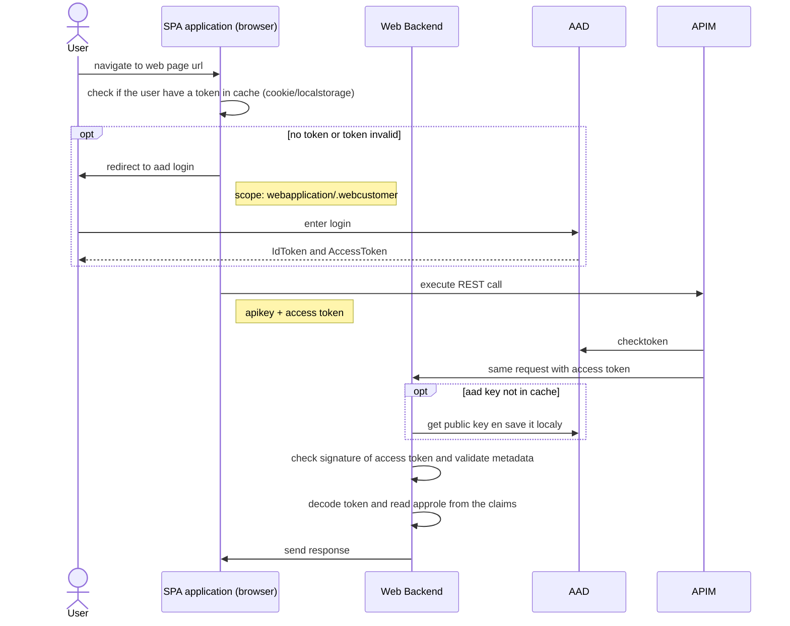
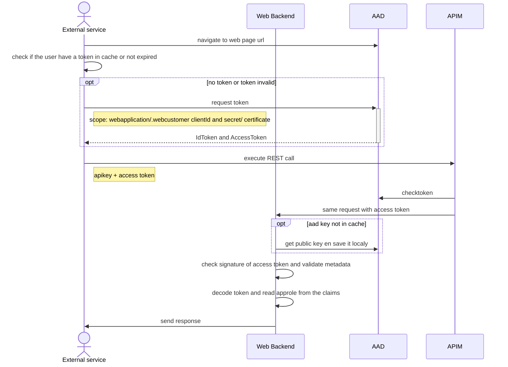
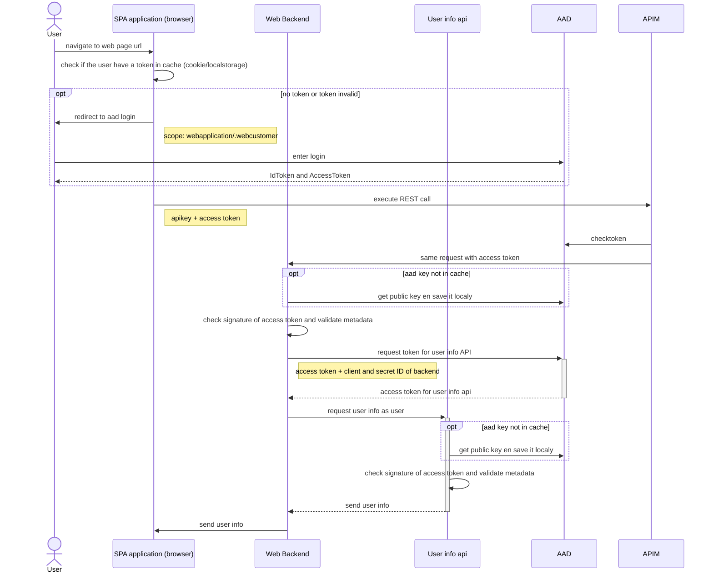

# How to secure your app with Azure AD
This repo explain how to secure your azure application (internal or external) leveragin Azure AD

 - **Scenario 1: User authentication to a backend

 - Scenario 2: External service authentication to backend 

 - **Scenario 6: On behalf scenario

